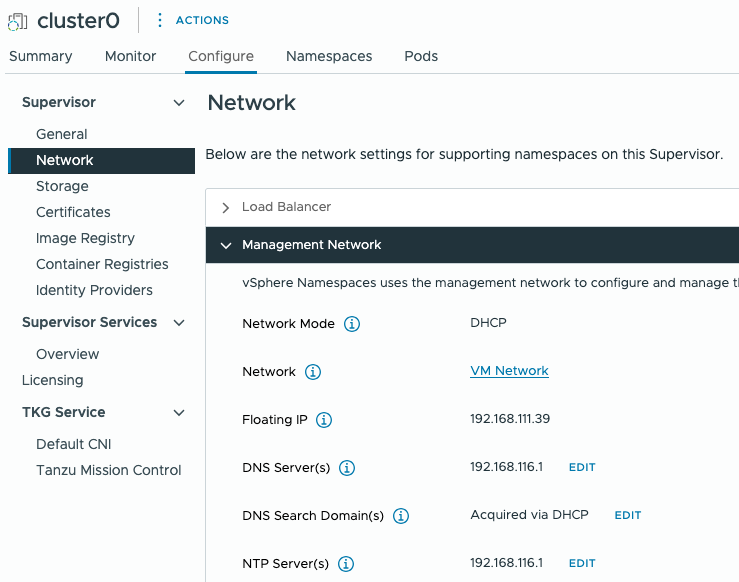
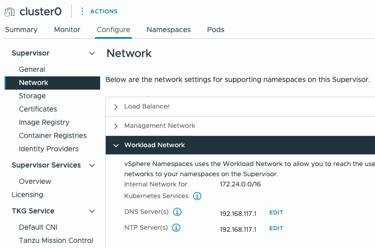

# Run on local machine where sheepctl is:
* Set exports
```
export LOCKID=0e450633-978c-4704-9432-f047731afbf5
export ENVNAME=USEAST
```

* get lock details
```
sheepctl lock get ${LOCKID} > ${ENVNAME}.json
sheepctl lock get ${LOCKID} -j -o ${ENVNAME}-access.json
```
* Get kubeconfig for supervisor
```
sheepctl lock kubeconfig ${LOCKID} > ${ENVNAME}.kubeconfig
```
* User/pass for jumpbox
  - username = kubo
  - Password = sheepctl lock get ${LOCKID} -j |jq -r .outputs.vm.jumper.password

* FQDN/IP and Password for vCenter (not pretty)
  - IP = sheepctl lock get $LOCKID | jq -r .vc[].systemPNID
    * note:  **if your vCenter IP begins with 192.168, you'll have to use the proxy to reach it<br>If it begins with 10, you should be able to reach it via FQDN**
  - FQDN = sheepctl lock get $LOCKID | jq -r .vc[].systemPNID
  - Password = sheepctl lock get ${LOCKID}  | jq -r .vc[].password

* Get jumpbox IP, export to envvar
```
export JUMPERIP=$(sheepctl lock get ${LOCKID} -j |jq -r .outputs.vm.jumper.hostname)
```


* Create a $HOME/.kube directory on the jumpbox
```
ssh kubo@$JUMPERIP -t 'mkdir -p $HOME/.kube'
```

*  copy files from local to jumpbox - run on local machine where sheepctl is
```
scp -p resources/dnsmasq-install.sh kubo@$JUMPERIP:/home/kubo/
scp resources/storageclass-tpsm.yaml kubo@$JUMPERIP:/home/kubo/
scp resources/set-baseline.yaml kubo@$JUMPERIP:/home/kubo/
scp resources/cluster-tpsm.yaml kubo@$JUMPERIP:/home/kubo/
scp ${ENVNAME}.kubeconfig kubo@$JUMPERIP:/home/kubo/.kube/config
```

## Configure Firefox to use Proxy - necessary to reach vCenter and TPSM
Use firefox on local machine: Set Network Settings as follows:

* Select Manual proxy configuration
  * HTTP Proxy:  $JUMPERIP
  * port: 443
  * Also use this proxy for HTTPS
* No proxy for ".mozilla.org, mozilla.com, google.com,127.0.0.1/8"
* Proxy DNS when using SOCKS v4


# Login to Jumpbox
```
ssh kubo@$JUMPERIP
```
* update squid proxy port
  ```
  sudo sed -i 's|http_port 3128|http_port 443|g' /etc/squid/squid.conf
  sudo systemctl restart squid
  ```

* add dns record for tanzu.platform.io
  ```
  echo 'address=/tanzu.platform.io/192.168.116.206' | sudo tee /etc/dnsmasq.d/vlan-dhcp-dns.conf
  sudo systemctl restart dnsmasq
  ```

* Install prereqs on jumpbox
  * Carvel Tools
  ```
  mkdir -p build/
  curl -kL https://carvel.dev/install.sh | K14SIO_INSTALL_BIN_DIR=build bash
  sudo cp -r ./build/* /usr/local/bin/
  ```
  * Tanzu CLI
  ```
  sudo apt install -y ca-certificates curl gpg
  ```
  ```
  sudo mkdir -p /etc/apt/keyrings
  curl -fsSL https://storage.googleapis.com/tanzu-cli-installer-packages/keys/TANZU-PACKAGING-GPG-RSA-KEY.gpg | sudo gpg --dearmor -o /etc/apt/keyrings/tanzu-archive-keyring.gpg
  echo "deb [signed-by=/etc/apt/keyrings/tanzu-archive-keyring.gpg] https://storage.googleapis.com/tanzu-cli-installer-packages/apt tanzu-cli-jessie main" | sudo tee /etc/apt/sources.list.d/tanzu.list
  sudo apt update
  sudo apt install -y tanzu-cli
  ```
  * Crashd
  ```
  wget https://github.com/vmware-tanzu/crash-diagnostics/releases/download/v0.3.10/crashd_0.3.10_linux_amd64.tar.gz
  mkdir -p crashd_0.3.10_linux_amd64
  tar -xvf crashd_0.3.10_linux_amd64.tar.gz -C crashd_0.3.10_linux_amd64
  sudo mv crashd_0.3.10_linux_amd64/crashd  /usr/local/bin/crashd
  ```
# On vCenter UI


## Create VMClass in testns namespace
  * name: tpsm
  * CPU: 8
  * RAM: 32GB
  * Reservation: none

## Verify Supervisor Workload Network config
The DNS for the workload network managed by the Supervisor should be set to 192.168.117.1 - one of the interfaces on the jumpbox.  If it is not, we need to change it to use our dnsmasq server on the jumpbox.  
* First, on the machine you ran shepctl on, grab the the hostname and password to access vCenter:
  * `jq '.outputs.vm["vc.0"]' ${ENVNAME}-access.json`
* Go the the hostname (ip, actually) in your browser and login to vCenter as "administrator@vsphere.local" with the password you got from the previous command.
  * Go to Workload Management via the hamburger menu on the top left of the browser page.
  * Click on the "Supervisors" tab under the "Workload Management" heading in the top, middle of the page.
  * Click on the "tkgs-cls" Supervisor to open its details.
  * Click on the "Configure" tab in the resulting details page.
  * In the tree-view near the "Configure" tab you just clicked, under the "Supervisor" section of the tree, click "Network"
  * In the "Network" page, there are a few expandable sections.  Click the section called "Workload Network" to expand it
  * Next to the DNS server, click the "Edit" link next to that DNS value.  Update the DNS server to be 192.168.117.1, and click the "Save" button.
* repeat for the DNS Server value in the Management network, but it should be set to 192.168.116.1 instead

<br>


# Supervisor cluster - run on jumpbox
* confirm access to supervisor cluster
  ```
  kubectl get ns testns
  ```

* Create Cluster & wait for ready
  ```
  kubectl apply -n testns -f cluster-tpsm.yaml
  ```
    * wait for ready:
    ```
    watch -n 30 kubectl get tanzukubernetescluster -n testns tpsm -ojsonpath='{.status.phase}'
    ```

* get kubeconfig for tpsm cluster
  ```
  kubectl get secret -n testns tpsm-kubeconfig -ojsonpath='{.data.value}' | base64 -d > tpsm-kubeconfig
  ```

* Merge kubeconfig
  * set KUBECONFIG env var:
  `export KUBECONFIG=~/.kube/config:~/tpsm-kubeconfig`

  * Flatten to new file:
  `kubectl config view --flatten > ~/combo.config`

  * Replace ~/.kube/config
  `cp combo.config ~/.kube/config`

* Change context to tpsm cluster
  ```
  kubectl config use-context tpsm-admin@tpsm
  ```
# Prepare target cluster
Make sure your context is tpsm-admin@tpsm
* Install cert-manager
  ```
  kubectl apply -f https://github.com/cert-manager/cert-manager/releases/download/v1.16.2/cert-manager.yaml
  ```
* Create tpsm storageClass
  ```
  kubectl apply -f storageclass-tpsm.yaml
  ```
* install Kapp controller
  * check to see if kapp controller exists:
  `kubectl get po -A -l app=kapp-controller`
  * if it does not, install it
  ```
  kapp deploy -a kc -f <(ytt -f https://github.com/carvel-dev/kapp-controller/releases/download/v0.50.0/release.yml -f set-baseline.yaml -v namespace=kapp-controller)
  ```

* Install SecretGen Controller
  ```
  kapp deploy -a sg -f https://github.com/carvel-dev/secretgen-controller/releases/latest/download/release.yml
  ```


# Install TPSM - run on jumpbox

## Download non-airgapped bits from artifactory to jumpbox
If you don't have access to get your identity token, you may need to request access to the "Artifactory SaaS BSG" instance via 1.Support.  You can follow the instructions at https://broadcomitsm.wolkenservicedesk.com/wolken-support/article?articleNumber=KB0005807 to get access.
```
export ARTIFACTORY_USER=jd123456 # broadcom user ID
export ARTIFACTORY_API_TOKEN=abc123 # Identity token from https://usw1.packages.broadcom.com/ui/user_profile
export TANZU_SM_VERSION=10.0.0-oct-2024-rc.533-vc0bb325 # This is the October 10.0 release, set as needed
export DOCKER_REGISTRY=tis-tanzuhub-sm-docker-dev-local.usw1.packages.broadcom.com

curl -u ${ARTIFACTORY_USER}:${ARTIFACTORY_API_TOKEN} https://usw1.packages.broadcom.com/artifactory/tis-tanzuhub-sm-docker-dev-local/hub-self-managed/${TANZU_SM_VERSION}/releases/non-airgapped/tanzu-self-managed-${TANZU_SM_VERSION}-linux-amd64.tar.gz --output tanzu-self-managed-${TANZU_SM_VERSION}.tar.gz
```

## Extract to ~/tpsm
```
mkdir ./tpsm
tar -xzvf tanzu-self-managed-${TANZU_SM_VERSION}.tar.gz -C ./tpsm
```
## Update config.yaml
```
sed -i 's|profile: foundation|profile: evaluation|' tpsm/config.yaml
sed -i 's|loadBalancerIP: ""|loadBalancerIP: "192.168.116.206"|' tpsm/config.yaml
sed -i 's|host: ""|host: "tanzu.platform.io"|' tpsm/config.yaml
sed -i 's|storageClass: ""|storageClass: "tpsm"|g' tpsm/config.yaml
sed -i ' 80 s|password: ""|password: "admin123"|' tpsm/config.yaml
sed -i ' 153 s|name: ""|name: "tanzu-sales"|' tpsm/config.yaml
sed -i 's|#  oauthProviders:|  oauthProviders:|g' tpsm/config.yaml
sed -i ' 92 s|#    - name: ""|    - name: "okta.test"|' tpsm/config.yaml
sed -i ' 97 s|#      configUrl: ""|      configUrl: "https://dev-70846880.okta.com/.well-known/openid-configuration"|'  tpsm/config.yaml
sed -i ' 99 s|#      issuerUrl: ""|      issuerUrl: "https://dev-70846880.okta.com"|' tpsm/config.yaml
sed -i ' 101 s|#      scopes: \["openid"]|      scopes: \["openid", "email", "groups"]|' tpsm/config.yaml
sed -i ' 103 s|#      loginPageLinkText: ""|      loginPageLinkText: "Login with Dev Okta"|'  tpsm/config.yaml
sed -i ' 105 s|#      clientId: ""|      clientId: "0oaggqbiqdlnTtfFY5d7"|'  tpsm/config.yaml
sed -i ' 107 s|#      secret: ""|      secret: "UMdEVboJTSfHAQEbuIlj1j2zticsxBRiEuRLYsfJk6dbeR9Nh47qH_7E_7q7MVT1"|' tpsm/config.yaml
sed -i ' 109 s|#      attributeMappings:|      attributeMappings:|' tpsm/config.yaml
sed -i ' 111 s|#        username: ""|        username: "email"|' tpsm/config.yaml
sed -i ' 113 s|#        groups: ""|        groups: "groups"|' tpsm/config.yaml
```

## verify
```
cd ./tpsm
./tanzu-sm-installer verify -f config.yaml -u "${ARTIFACTORY_USER}:${ARTIFACTORY_API_TOKEN}" -r ${DOCKER_REGISTRY}/hub-self-managed/${TANZU_SM_VERSION}/repo --install-version ${TANZU_SM_VERSION}
```
Watch the verification for [x] lines and resolve any that arise.
Looking to see **Success: The hostname 'tanzu.platform.io' resolves to 192.168.116.206** and **Completed pre-check(s) validation**


## Install!!
```
./tanzu-sm-installer install -f config.yaml -u "${ARTIFACTORY_USER}:${ARTIFACTORY_API_TOKEN}" -r ${DOCKER_REGISTRY}/hub-self-managed/${TANZU_SM_VERSION}/repo --install-version ${TANZU_SM_VERSION}
```
* once the install starts, you can break out of it to check the status:
  * `tanzu package installed list -n tanzusm`
  * `kubectl get pkgi -n tanzusm`


## Connect
**Browse to https://tanzu.platform.io in Firefox (configured for proxy)**


# tear down
* Remove TPSM
```
./tanzu-sm-installer reset --kubeconfig ~/.kube/config --include-pv-deletion
```
